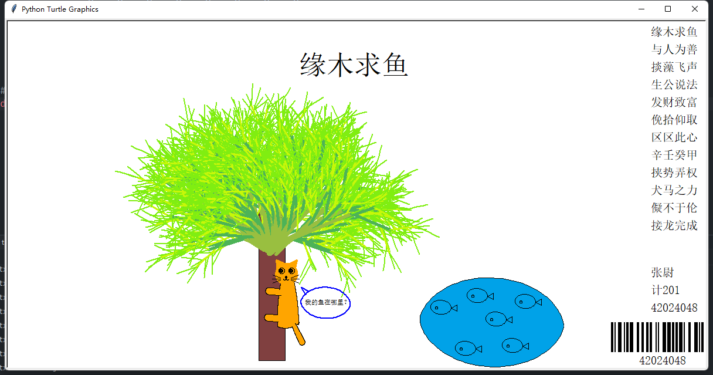

# 表格上的皇后开发日记

---

## 安装库需要

需要安装`openpyxl`，指令：

`pip install openpyxl`

## 开发流程

### 一、解决N皇后问题

N皇后问题是一道经典的算法题，利用了回溯递归的方法

具体思想是，从第一行开始遍历1-N列，要保证每行每列和两个对角线均不存在皇后，利用三个数组column,diag(i-j相同的关系),diag2(i+j相同的关系)标记是否曾经被访问过

如果找到了每行每列和两个对角线均不存在皇后，则递归进入下一行，继续上面的操作，如果遍历了每一列后都无法找到，就return返回，并把标记过的数组恢复

最后将结果存储在数组中

### 二、将N皇后结果输入到excel表格中

利用`openpyxl`库完成输入操作，创建新.xlsx格式的文件，并且获取工作页进行输入。

将表格渲染成黑白相间，可以利用判断(i+j)是否为偶数来判断填充黑色或是白色，背景为白色则字体为黑色，反之亦然

遍历存储数组中的所有结果，根据索引将结果输出到表格中

设置行高和列宽，字体的大小，水平居中和垂直居中，即完成了输入

---

## 效果截图

## 

