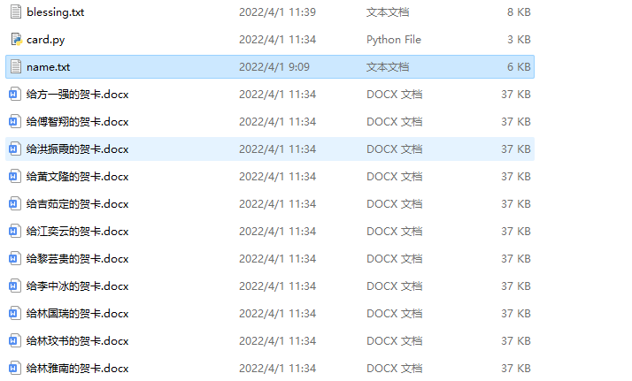
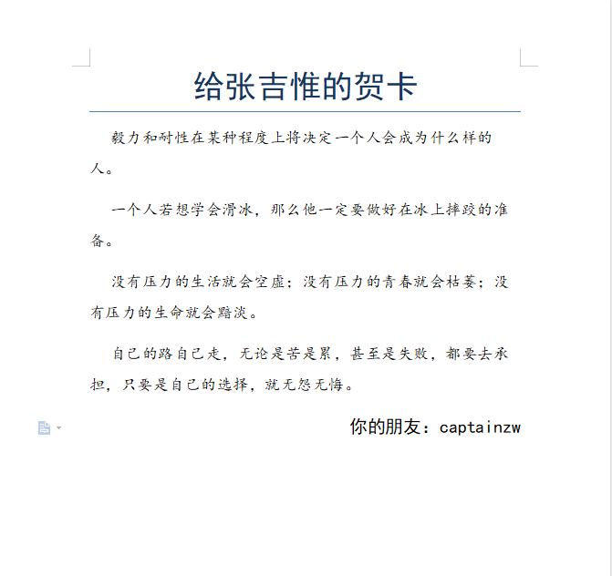

# 好友贺卡开发日记

---

## 安装库需要

需要docx库，安装指令：

`pip install python-docx`

## 开发流程

### 存储文本

- 建立`blessing.txt`其中存储的是祝福的话语，我存储的格式为`\t 数字 、文字\n`,`\n`

  ​	例如 :

  ​			1、万里寻山历百艰而无悔，一朝见井纵九死以何辞。

  

- 建立`name.txt`其中存储的是朋友的任命，存储格式为`名字、名字`

  ​	例如：

  ​			张吉惟、林国瑞、林玟书、林雅南

### 导入文本

将文本导入到python程序中，其中

- 祝福的话语采用正则表达式的方式重新存储，只保留文字

- 名字采用List容器的`.split('、')`方法分割名字

### 创建Word文本

新建Word文本，规定标题为给`XXX`的的贺卡。之后从祝福的话语中随机挑选4句写入Word中，其中检查祝福的话语不能重复，并设定文本的格式。然后加入署名。最后再设置字体格式后保存即可

## 程序效果截图

