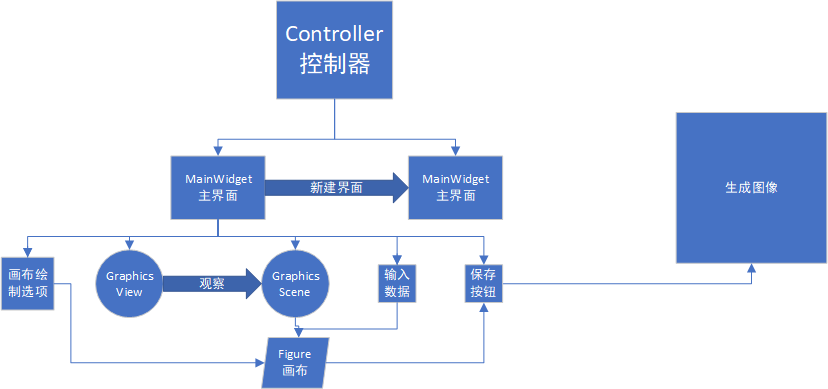
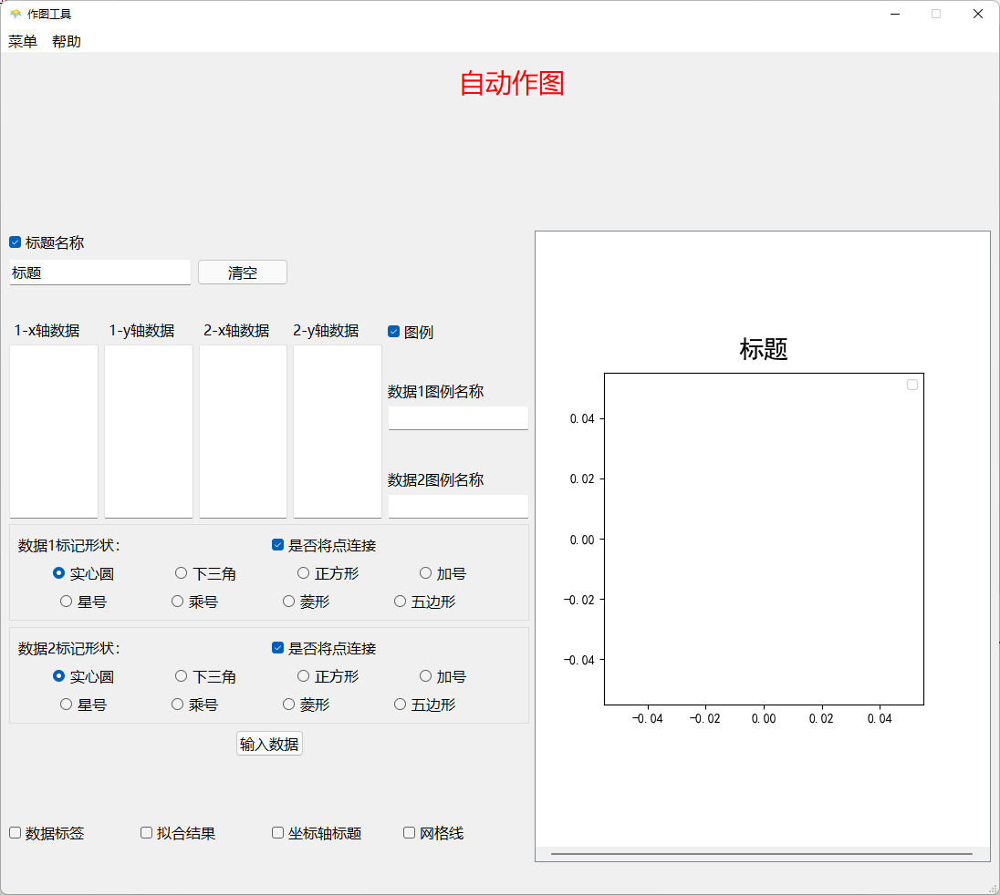
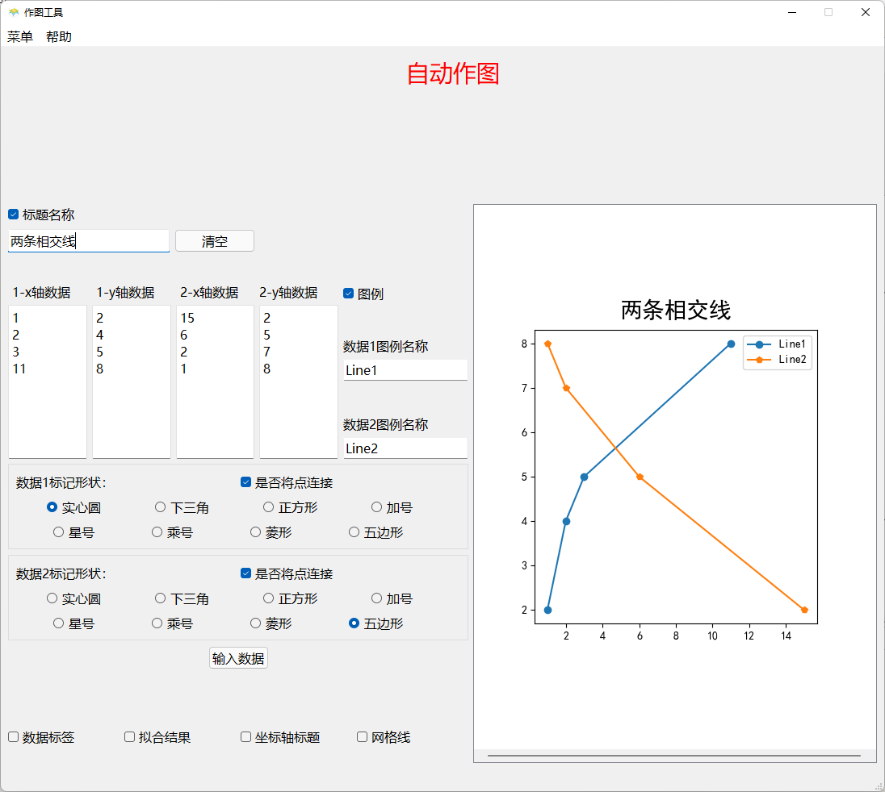
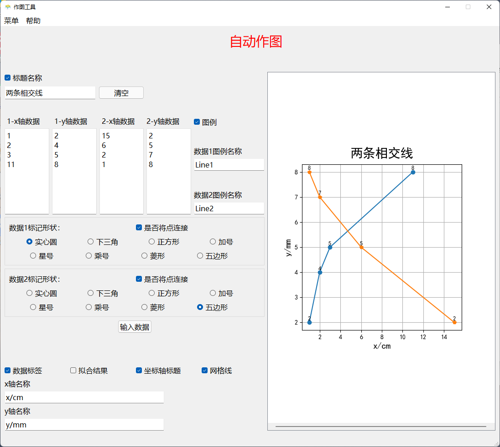
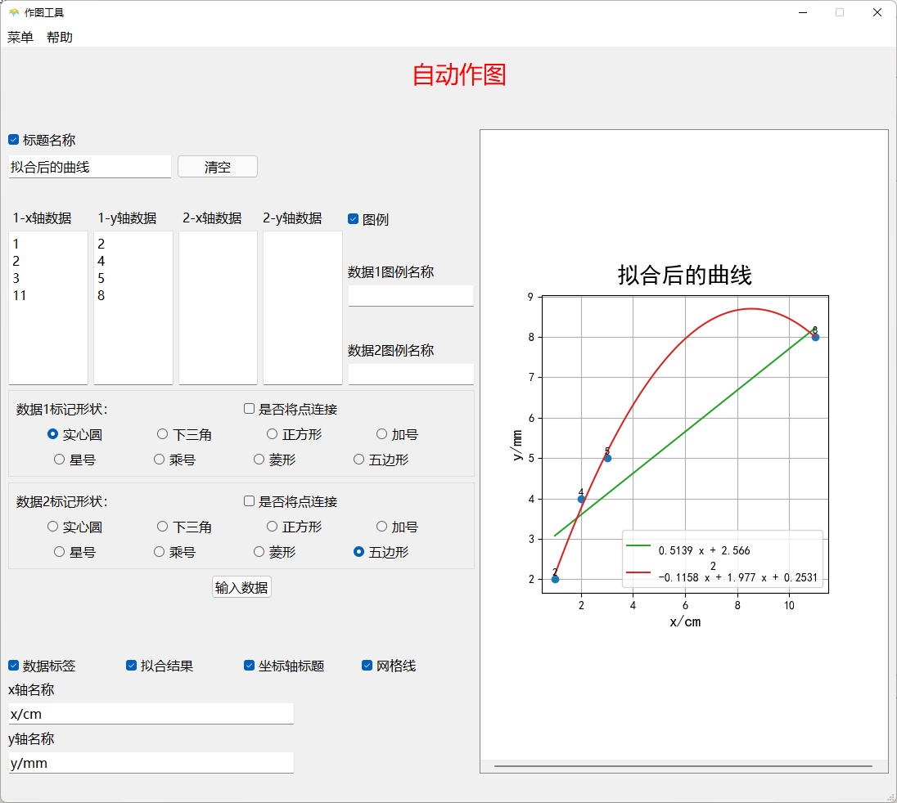

# 基于Qt及Matplotlib的图形化简单作图软件

​	设计了一套基于Qt及Matplotlib的图形化简单作图软件，简化利用Python作图时的重复并且难以记忆的代码及改善难以实时观察改变结果的弊端。利用Qt实现了一套图形化的界面可以提供较为基本的作图选项和更加美观的样式。在报告中还测试了一些输入非法的情况的特殊处理和作图的最终结果。作图的结果可以实时观察也可以进行.png格式和.jpg格式的存储

---


## 1. 程序展示和测试

总体结构



进入程序显示的界面：



输入数据后点击输入数据后：



添加图像格式后：



数据拟合效果：



x,y轴输入不合法的情况：


## 2.代码实现

### 2.1 Python版本

`Python 3.8.2 (tags/v3.8.2:7b3ab59, Feb 25 2020, 23:03:10) [MSC v.1916 64 bit (AMD64)] on win32`

### 2.2 依赖库

#### 2.2.1 Qt5

Qt version 5.15.2

- `PyQt5.QtGui`
- `PyQt5.QtCore.Qt`
- `PyQt5.QtCore.QRectF`
- `PyQt5.QtGui.QPainter`
- `PyQt5.QtWidgets.QApplication`
- `PyQt5.QtWidgets.QMainWindow`
- `PyQt5.QtWidgets.QGraphicsScene`
- `PyQt5.QtWidgets.QFileDialog`
- `PyQt5.QtWidgets.QMessageBox`
- `PyQt5.QtWidgets.QPushButton`
- `ui.uiplot.Ui_MainWindow`
- `PyQt5.QtCore`
- `PyQt5.QtGui`
- `PyQt5.QtWidgets`

#### 2.2.2 matplotlib

`matplotlib-3.5.1`

#### 2.2.3 numpy

`numpy-1.22.2`

#### 2.2.4 sys

python自带

### 2.3 外部工具

Qt Designer 使用版本：5.15.2

### 2.4 部分代码

```python
 if self.xAxisData.toPlainText() != "":
            try:
                x1 = self.xAxisData.toPlainText().split('\n')
                y1 = self.yAxisData.toPlainText().split('\n')
                for i, j in zip(x1, y1):
                    if i == "" or i == " " or i == "\n":
                        pass
                    else:
                        self.x1.append(float(i))
                    if j == "" or j == " " or j == "\n":
                        pass
                    else:
                        self.y1.append(float(j))
                if len(self.x1) != len(self.y1):
                    ex = NotEqualLengthError("数据1中的x轴数据与y轴数据长度不一致")
                    raise ex
                print(len(self.x1),len(self.y1))
            except NotEqualLengthError as e:
                QMessageBox.warning(self,"警告",e.message)
            except ValueError:
                QMessageBox.warning(self,"警告","数据1中的输入的数据不是数字")
            except:
                QMessageBox.warning(self,"警告","数据1中的输入的数据不合法")
            else:
                self.plotWithPoint(self.x1, self.y1, self.data1LegendLineEdit.text(), 1)
```

​			此处对输入进入的数据1的数据进行处理，首先按照'\n'即回车键对数据进行分割，再对数据进行遍历，对于'\n',''和' '等字符则不使其加入到self.x和self.y中，将正常的数据转化为float类型加入其中，对于长度不相等的数据抛出异常用对话框提示长度不一致，对于无法转换成float的数据用对话框提示输入的数据不是数字，对于其他的情况提示输入不合法，如果成功运行，则将数据进行绘图


```python
def updatePlot(self):
    self.paint.clear()
    if self.dataCheckBox.isChecked():
        self.plotWithPoint(self.x1, self.y1, self.data1LegendLineEdit.text(), 1)
        self.plotWithPoint(self.x2, self.y2, self.data2LegendLineEdit.text(), 2)
        for i, j in zip(self.x1, self.y1, ):
            self.paint.text(i, j + 0.04, '%.0f' % j, ha='center', va='bottom', fontsize=9)
        for i, j in zip(self.x2, self.y2, ):
            self.paint.text(i, j + 0.04, '%.0f' % j, ha='center', va='bottom', fontsize=9)
    elif not self.dataCheckBox.isChecked():
        self.plotWithPoint(self.x1, self.y1, self.data1LegendLineEdit.text(), 1)
        self.plotWithPoint(self.x2, self.y2, self.data2LegendLineEdit.text(), 2)
        if self.legendCheckBox.isChecked():
            self.paint.legend(loc='best')
    if self.gridCheckBox.isChecked():
        self.paint.grid(True)
    else:
        self.paint.grid(False)
    if self.axisTitleCheckBox.isChecked():
        self.paint.set_xlabel(self.xAxislineEdit.text(),fontsize=14,y=1.5)
        self.paint.set_ylabel(self.yAxisLineEdit.text(),fontsize=14)
    else:
        self.paint.set_xlabel("")
        self.paint.set_ylabel("")
    if self.titleCheckBox.isChecked():
        self.paint.set_title(self.titleEdit.text(),fontsize=20,y=1.02)
    else:
        self.paint.set_title("")
    if self.fittingResCheckBox.isChecked():
        self.fitting()
    self.F.draw()
```

​			此处更新画布，先将画布进行清除，判断是否选择了数据标记，如果有数据标记，则在每个点的上方写入此点的数据，如果没有数据标记则直接画图，再对网格、坐标轴、标题、拟合进行判断


```python
def lineFitting(self):
    if self.fittingResCheckBox.isChecked():
        if self.actionLineFitting.isChecked():
            try:
                f1 = np.polyfit(np.array(self.x1), np.array(self.y1), 1)
                p1 = np.poly1d(f1)
                print()
                self.paint.plot(self.x1, p1(self.x1), label=p1.__str__())
                if self.legendCheckBox.isChecked():
                    self.paint.legend()
            except:
                pass
            try:
                f2 = np.polyfit(self.x2, self.y2, 1)
                p2 = np.poly1d(f2)
                self.paint.plot(self.x2, p2(self.x2), label=p2.__str__())
                if self.legendCheckBox.isChecked:
                    self.paint.legend()
            except:
                pass
            self.F.draw()
        elif not self.actionLineFitting.isChecked():
            self.updatePlot()
        self.F.draw()
    else:
        self.updatePlot()
```

判断当前的数据拟合复选框是否选择，未被选中直接更新画布，选中则判断线性拟合是否被选择，被选中则开始进行拟合，未被选中更新画布


